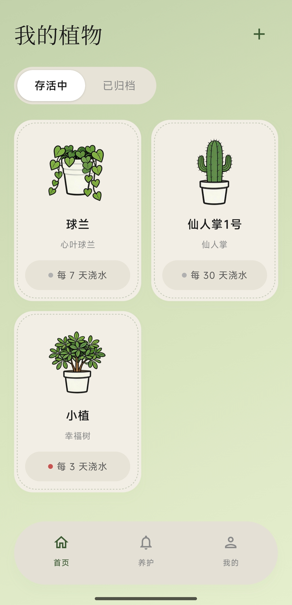
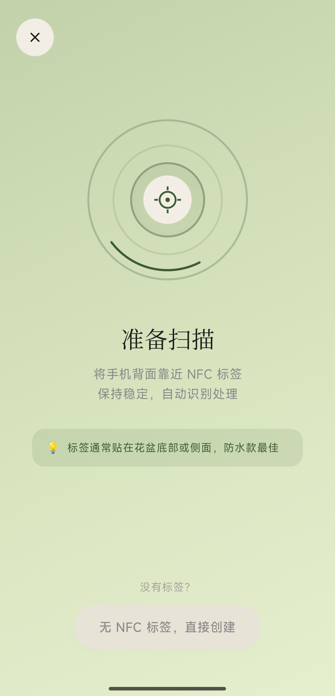
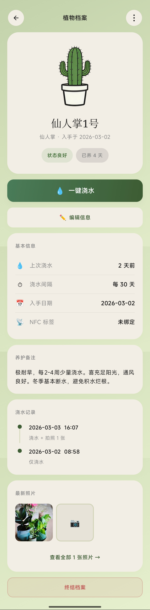
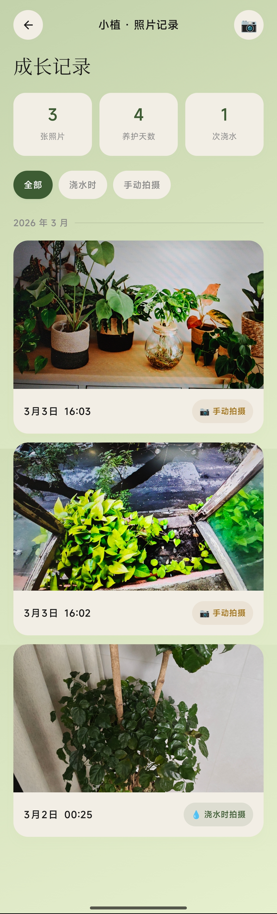

# 🌿 植物档案 (Plant ID)

> 给每株植物一张身份证，让养护变得简单有趣

[](https://developer.android.com/)
[](https://kotlinlang.org/)
[](https://developer.android.com/jetpack/compose)
[](LICENSE)

一款基于 NFC 标签的智能植物养护应用，通过一碰即达的方式快速访问植物档案，让浇水提醒不再依赖推送通知，而是在你需要时自然出现。

---

## ✨ 功能特性

### 🏷️ NFC 标签绑定
- 为每株植物生成专属 NFC 标签
- 手机靠近标签，自动打开对应档案
- 支持跨设备共享（家庭成员可各自绑定）

### 💧 智能浇水管理
- 自动计算浇水间隔
- 可视化状态指示（小圆点颜色实时反馈）
- 不再依赖推送通知，信息在你需要时出现

### 📸 成长照片时间线
- 记录植物的每一次生长变化
- 按时间顺序自动排列
- 见证从幼苗到繁茂的全过程

### 🎯 档案管理
- 存活中与已归档分类管理
- 详细的养护记录（上次浇水时间、浇水周期）
- 优雅的 UI 设计与流畅动画

---

## 📱 截图展示

<div align="center">
  
  
  
  
</div>

*从左到右：首页植物列表 | NFC 扫描界面 | 植物档案详情 | 照片时间线*

---

## 🛠️ 技术栈

- **语言**: Kotlin 1.9+
- **UI 框架**: Jetpack Compose (Material 3 Design)
- **架构**: MVVM + Repository 模式
- **数据库**: Room (SQLite)
- **图片加载**: Coil (支持 SVG)
- **后台任务**: WorkManager (定时浇水提醒)
- **NFC**: Android NFC API (NDEF 格式读写)
- **其他**: 
  - Kotlin 协程 (Flow)
  - Navigation Component
  - ViewModel
  - SharedPreferences

---

## 📲 系统要求

- **最低系统**: Android 7.0 (API 24)
- **目标系统**: Android 15 (API 36)
- **NFC 功能**: 支持 NFC 的设备可获得完整体验
  - 不支持 NFC 的设备可手动管理植物档案

---

## 🚀 快速开始

### 环境要求
- Android Studio Hedgehog (2023.1.1) 或更高版本
- JDK 11+
- Android SDK Platform 36

### 安装步骤

1. **克隆项目**
```bash
git clone https://github.com/wuwendi04-star/plant-id.git
cd plant-id
```

2. **用 Android Studio 打开**
```
File → Open → 选择项目根目录
等待 Gradle 同步完成
```

3. **运行应用**
```
连接 Android 设备或启动模拟器
点击 Run 'app' (绿色三角形按钮)
或使用快捷键：Shift + F10
```

### 构建 Release 版本

```bash
# Windows PowerShell
.\gradlew assembleRelease

# 输出的 APK 位于
app/build/outputs/apk/release/app-release-unsigned.apk
```

---

## 📁 项目结构

```
plant-id/
├── app/
│   ├── src/main/
│   │   ├── java/com/example/plant_id/
│   │   │   ├── data/          # 数据层（Entity, DAO, Database）
│   │   │   ├── nfc/           # NFC 读取与写入逻辑
│   │   │   ├── notification/  # 通知管理
│   │   │   ├── ui/            # UI 层（Screens, Components, Theme）
│   │   │   │   ├── components/    # 可复用组件（PlantCard, StatusPill）
│   │   │   │   ├── navigation/    # 导航配置
│   │   │   │   ├── screens/       # 页面（Home, Detail, NfcScan）
│   │   │   │   ├── theme/         # 主题与颜色
│   │   │   │   └── viewmodel/     # ViewModel
│   │   │   ├── worker/        # 后台任务（浇水提醒 Worker）
│   │   │   └── MainActivity.kt
│   │   ├── res/               # 资源文件（布局、图片、颜色）
│   │   └── AndroidManifest.xml
│   └── build.gradle.kts
├── gradle/                    # Gradle 包装器与配置
├── README.md                  # 项目说明
└── LICENSE                    # 开源协议
```

---

## 🤝 贡献指南

欢迎提交 Issue 和 Pull Request！

1. Fork 本仓库
2. 创建特性分支 (`git checkout -b feature/AmazingFeature`)
3. 提交更改 (`git commit -m 'Add some AmazingFeature'`)
4. 推送到分支 (`git push origin feature/AmazingFeature`)
5. 开启 Pull Request

---

## 📄 开源协议

本项目采用 [MIT 协议](LICENSE) 开源。

---

## 👨‍💻 作者

- https://github.com/wuwendi04-star

---

## 🙏 致谢

感谢以下开源项目：

- [Jetpack Compose](https://developer.android.com/jetpack/compose)
- [Room Database](https://developer.android.com/training/data-storage/room)
- [Coil](https://coil-kt.github.io/coil/)
- [Material Design 3](https://m3.material.io/)

---

## 📬 联系方式

- 问题反馈：[GitHub Issues](https://github.com/你的用户名/plant-id/issues)
- 邮件联系：676951326@qq.com

---

<div align="center">
  <p>如果这个项目对你有帮助，请给一个 ⭐️ Star 支持！</p>
  <p>🌿 让每株植物都被认真对待</p>
</div>
